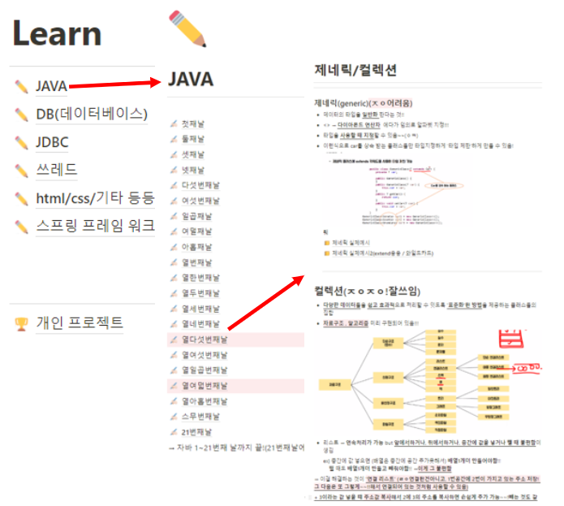
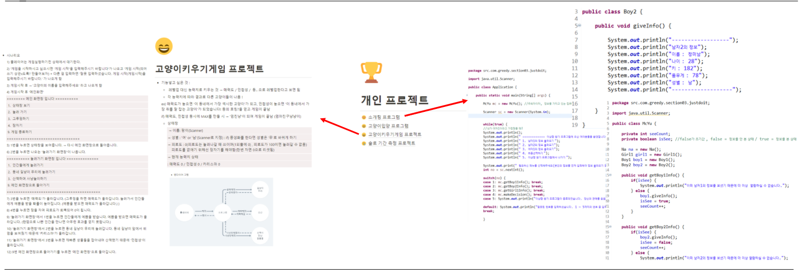
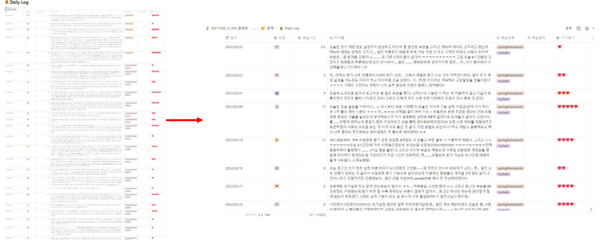

- 관심있는 기술 

  - java : 가장 보편화 되있기도 하고, 배우면 배울 수록 배울 것이 많은 흥미를 유발하는 언어라고 생각하기 때문에 관심이 있습니다.

  - ajax : Semi, Final Project를 진행하면서 많이 접하게 되었고, 잘 사용한다면 'jsp,html 등과 controller를 자유자재로 효율적으로 연결할 수 있지 않을까' 라는 생각에 관심이 있습니다. 

  - C언어 : 가볍게 즐길 수 있는 '힐링용 모바일' 게임을 만들어 보고 싶어서 관심이 있습니다.

  - jpa : 외국에서 많이 사용한다고 하며 mybatis보다 코드가 간단해진다는 장점이 있어 관심이 있습니다.

    

- 지금까지 사용해 본 것들 

  - 언어 : java 
  - 기술 : jdbc , ajax,  oracle(DB) , jquery, javascript, tomcat 등
  - 툴 : eclipse, STS, intellij, DBever, Sqldeveloper64W, VScode 등

  

- 어떤 개발자가 되고 싶은가 ? 

  - 자기계발을 열심히 하며 맡은 일에 최선을 다해 같이 일하고 싶은 개발자

- 이를 위해 한 노력 ?

1) 비전공자이기 때문에 모르는 부분은 강사님이나, 학우 분들께 질문하였고 혼자 구글링을 하여 기본적인 IT 개념을 숙지하려 노력하였습니다.

     

2)  배운 개념을 조금이라도 활용하여 '개인 미니 프로젝트'를 만들기도 하였습니다. 

   

3)  Notion에서 dailyLog라는 '매일 쓰는 개발일기'를 하루도 빠짐없이 작성하여 본인의 위치를 파악하고 반성하며 성장해나갈 수 있도록 하였습니다.

   

4) Mini, Semi, Fianl Project에서 본인이 맡은 일에 최선을 다하고 나아가 팀원들과 소통하도록 노력했습니다.  (Projects 메뉴바에서 자세히 확인하실 수 있습니다.)

   

 
