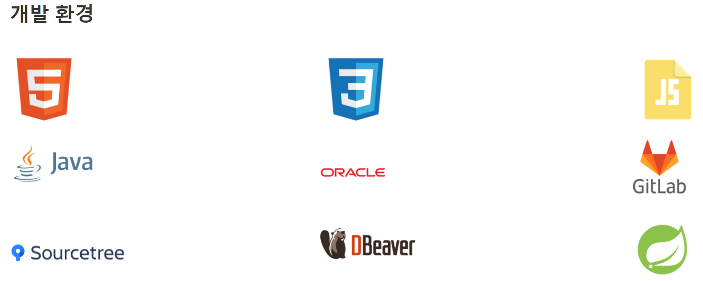
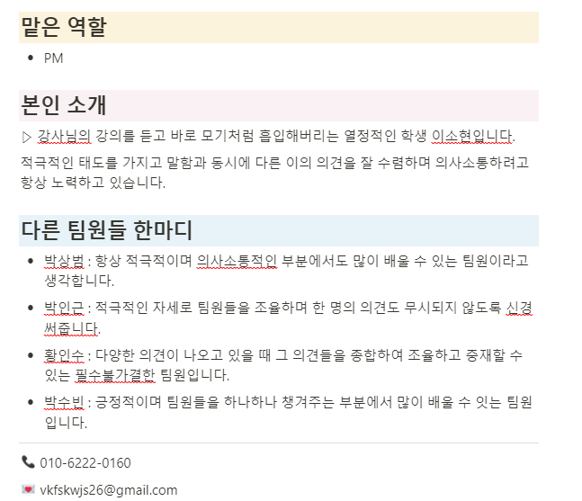
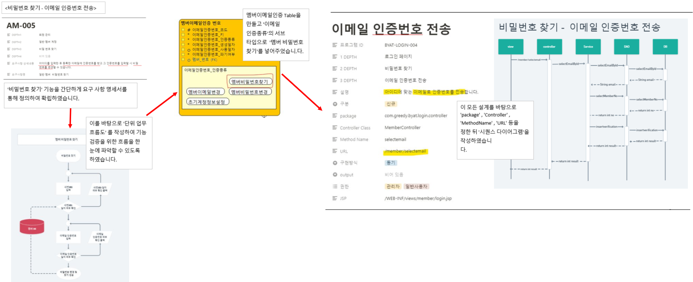
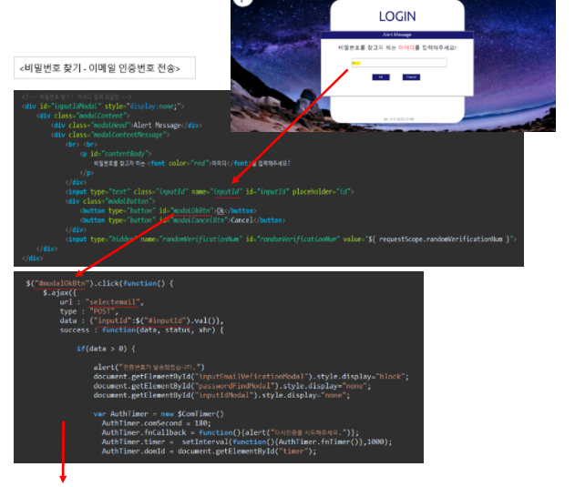
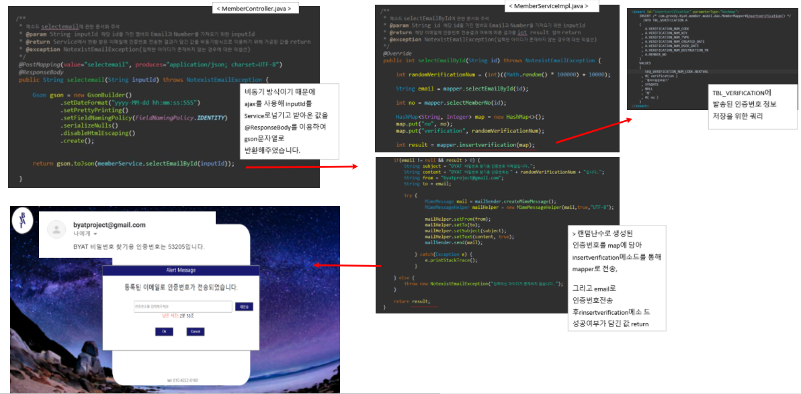

# Projects

- [Mini Project](#mini)
- [Semi Project](#semi)
- [Final Project](#final)

(2) Semi Project

- 프로젝트 이름 : BYAT(Better-than-Your-Agile-Tool)

- 프로젝트 소개 : IT중소기업을 대상으로 프로세스를 관리해주는 PMS 서비스 프로그램

- 개발 환경
  - Java : OS에 독립적이며 프로그램 실행 시 필수적인 시점에만 로딩하여 불필요한 메모리 낭비가 없어 효율적이기 때문에 사용하였습니다.
  - Oracle : BYAT는 대량의 정보관리가 필요하기 때문에 대규모 DB를 지원하고 MYSSQL, MYSQL보다 좋은 성능을 보여주는 오라클을 사용하였습니다.
  - Sts :
  - HTML5 : 파일 용량이 작아 클라이언트-서버 간 빠른 문서 전달이 가능하기 때문에 사용하였습니다.
  - CSS3 : 웹 사이트의 스타일을 일관성 있게 유지하고 추가적인 SW,플러그인 없이 HTML5 기능의 확장이 가능하기 때문에 시너지를 내기 위해 사용하였습니다.
  - JavaScript : 다른 프로그래밍 언어와 완벽하게 호환이 가능하기 때문에 HTML5, CSS3 함께 시너지를 내기 위해 사용하였습니다.
  - Sourcetree : git을 사용자가 쉽게 사용할 수 있도록 GUI환경을 제공해주기 때문에 사용하였습니다.
  - DBeaver
  - GitLab : 용량 무제한의 무료 레퍼지토리를 개인 및 공용으로 제공해주어 대량의 정보관리가 필요한 BYAT에 적합하다고 생각하여 사용하였습니다.
  

- 맡은 역할 : PM (회의록, 개발진행사항, 개발업무일지 등을 관리)

  * 개발업무일지 : 일일업무일지로 본인이 구현한 부분, 내용을 구체적으로 작성하여 '본인 진척율 파악'하고 내용에 대한 '팀원 확인' 등을 통해 프로젝트의 전체적인 진척율 관리에 도움이 될 수 있도록 하였습니다.
  * 개발진행사항 : 팀 전체의 진척율을 작성하고 하루하루 업데이트를 진행하여 가시적으로 전체적인 프로젝트 진행율을 파악하고 계획을 수정하는 데 도움이 되도록 하였습니다.

    

    

    

- 팀원 한마디 : '적극적이며 의사소통이 활발한 팀원'

  

- 프로그램 내 구현 기능 
  - 로그인  : 일반 멤버,관리자 등 사용자가 로그인 할 수 있도록 하는 목적을 가진 기능 
  - 로그아웃 : 일반 멤버, 관리자 등 사용자가 로그아웃 할 수 있도록 하는  목적을 가진 기능
  - 비밀번호 찾기 : 일반 멤버가 비밀번호를 잊어버렸을 경우 비밀번호를 찾고 변경할 수 있도록 하는  목적을 가진 기능
  - 최초 로그인 시 정보 등록 : 최초 로그인 시 사용자의 정보를 강제로 등록할 수 있도록 하는  목적을 가진 기능 
  - 멤버 계정 관리 :  관리자가 멤버 계정 추가 , 수정, 삭제 할 수 있도록 하는  목적을 가진 기능
  - 캘린더 : 일반 멤버, 관리자 등 사용자가 일정을 조회, 생성, 수정, 삭제 할 수 있도록 하는 목적을 가진 기능

- 구체적인 코드 설명

  - 비밀번호 찾기 - 이메일 인증번호 발송

    [전체적인 흐름]

    

    [코드 흐름]

    

    

